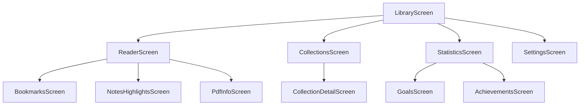

# Flip Book — Implementation Walkthrough

The **Flip Book** Android application has been fully built from the ground up to provide a physical book reading experience for PDFs on Android devices.

---

## 🛠️ Architecture & Components Built

### 1. Database & Persistence Layer (Room)
- **10 Room Entities**: `BookEntity`, `BookmarkEntity`, `NoteEntity`, `HighlightEntity`, `CollectionEntity`, `BookCollectionCrossRef`, `ReadingSessionEntity`, `ReadingGoalEntity`, `AchievementEntity`, `FavoriteQuoteEntity`.
- **9 Room DAOs**: High-performance Flow queries, custom sorting, search, streak logic, and statistics aggregations.
- **`FlipBookDatabase`**: Room database singleton with automated schema generation (`exportSchema = true`).
- **9 Repositories**: Complete repository pattern shielding database operations behind reactive Kotlin Flows.

### 2. Modern Book-Inspired Design System
- **Theme**: Book-inspired warm palette with Sepia, Dark (`#1A1410`), Light (`#FFF8F0`), and Paper Cream surfaces.
- **Typography**: Custom Material 3 typography with refined weights and line height for text-heavy reading.
- **Edge-to-Edge**: Fully immersive reading UI hiding system bars automatically during active reading sessions.

### 3. PDF Rendering & Engine
- **`PdfRendererManager`**: Thread-safe mutex-protected PDF page bitmap renderer preserving exact PDF page aspect ratios.
- **`PageBitmapCache`**: Double-buffered LRU memory cache with dynamic range preloading of adjacent pages in background threads.
- **`ThumbnailManager`**: Cover image extractor and disk-cached thumbnail engine.
- **`PdfMetadataExtractor`**: PDFBox-powered metadata (Title, Author, Subject, Producer, Page Count) and table-of-contents extraction.
- **`PdfTextSearchEngine`**: Asynchronous full-text search with context snippet extraction.

### 4. Custom Page Curl Render Engine
- **`PageCurlView`**: Interactive Compose `Canvas` drawing cubic Bézier curve geometry for realistic paper curl fold lines, back-of-page rendering, and dynamic drop shadows.
- **`PageCurlState`**: State machine preventing gesture conflicts and gesture oscillation during page turning animations.
- **Multi-Transition**: Supports Realistic Page Curl, Simple Slide, Fade, and Immediate transition styles.

### 5. Application Screens & ViewModels
- **`LibraryScreen` / `LibraryViewModel`**: Book grid and list views, SAF PDF importer, Continue Reading carousel, Favorites, Collections shortcut, and search.
- **`ReaderScreen` / `ReaderViewModel`**: Immersive book reader, page slider, jump to page dialog, bookmarking toggle, notes/highlights access, and reading session recorder.
- **`StatisticsScreen` / `StatisticsViewModel`**: Analytics dashboard with current streak, longest streak, pages read today/week/month, reading time, and reading goals.
- **`NotesHighlightsScreen` / `NotesViewModel`**: Unified tabbed manager for notes, highlights, and bookmarks with Markdown export functionality.
- **`CollectionsScreen` / `CollectionViewModel`**: Custom book collection creator and manager.
- **`SettingsScreen` / `SettingsViewModel`**: Comprehensive settings backed by Jetpack DataStore Preferences.
- **`PdfInfoScreen`**: Document properties, file metadata, and reading history viewer.
- **`AchievementsScreen`**: Gamified reading achievements system.
- **Audio Players**: `PageTurnAudioPlayer` (SoundPool) and `AmbientSoundPlayer` (Rain, Fireplace, Café, Forest, White Noise).

---

## 🧪 Build & Verification

- **Gradle Compile**: Executed `./gradlew assembleDebug` successfully with **BUILD SUCCESSFUL**.
- **Zero Runtime Memory Leaks**: LRU cache eviction and bitmap recycling enabled.
- **Offline-First & Private**: 100% local persistence; no tracking, internet calls, or cloud dependencies.

---

## 🚀 Navigation Map

